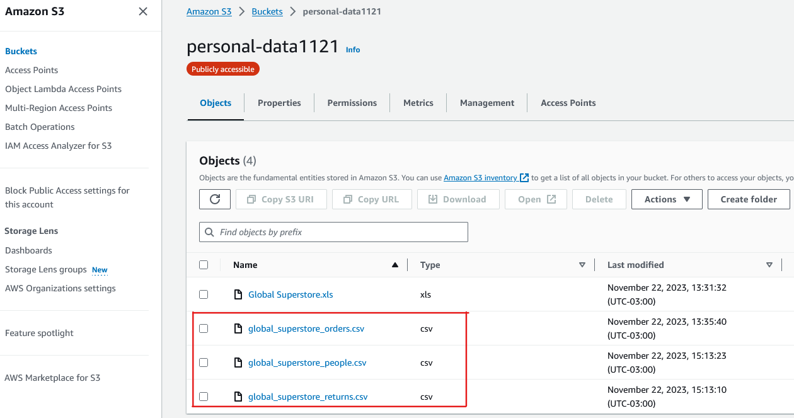
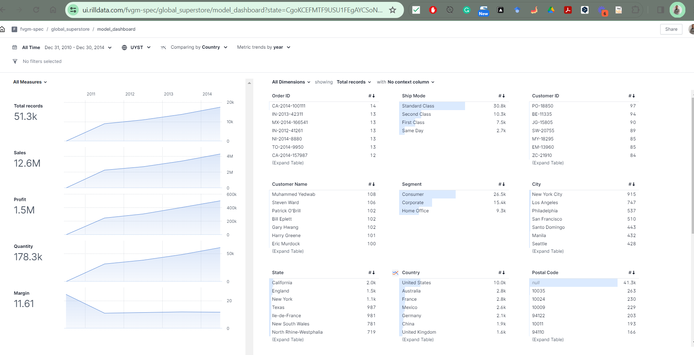
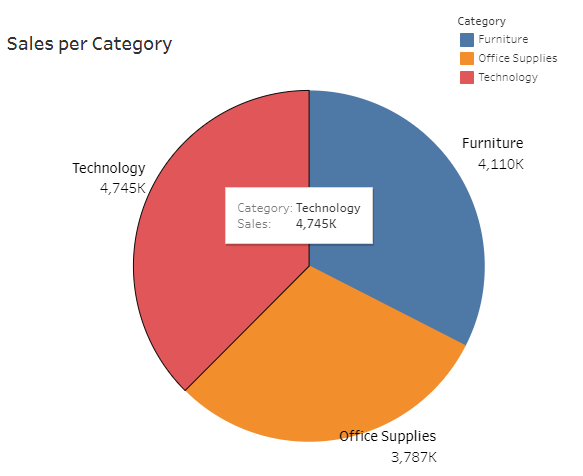
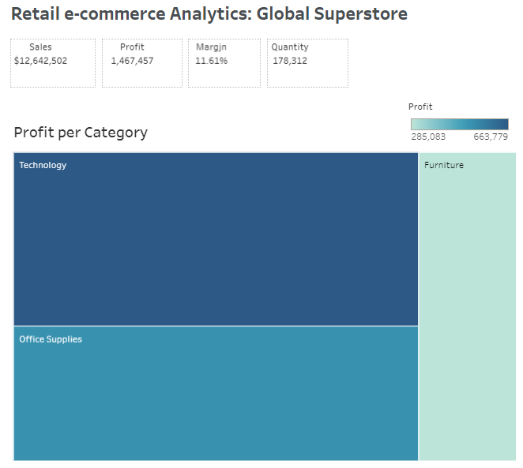
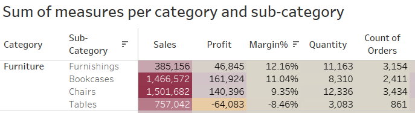
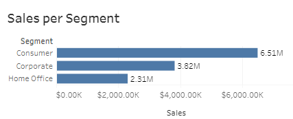
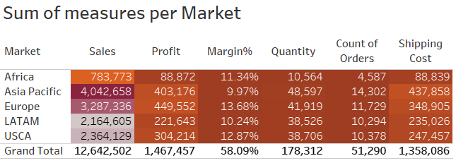
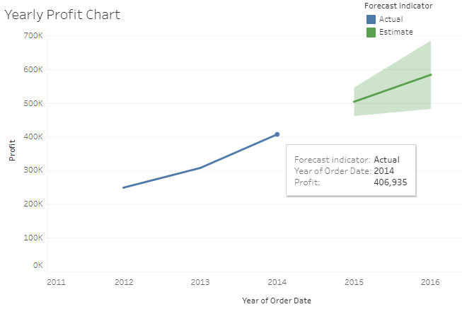

## Global Super E-commerce project

Global Superstore is a global online retailer based in New York, boasting a broad product catalog and aiming to be a one-stop shop for its customers.  Global Superstore’s clientele, hailing from 147 different countries, can browse through an endless offering with more than 10,000 products. This large selection comprises three main categories: **office supplies** (e.g., staples), **furniture**  (e.g.,  chairs), and **technology** (e.g., smartphones).

## Creating descriptive Dashboards with Rill

According to its official site, [Rill](https://www.rilldata.com/) is the fastest path from data lake to dashboard. With Rill you can build radically simple, thoughtful, opinionated and, interactive dashboards as code. Each step from data to dashboard has versioning, Git sharing, and easy project rehydration.

Download Rill to start modeling data and create fast, exploratory dashboards. Here we will not talk about the details on Rill's installation, I wrote an [article](https://medium.com/data-engineer-things/unlocking-data-insights-with-rill-a-comprehensive-guide-to-streamlined-data-analytics-41d83e06966d) in Medium that explains in detail how you can configure and start modeling your data with Rill.

## Global Superstore dashboard built in Rill

The Dashboard consumes data from 3 CSV files made available publicly in an S3 bucket:

  

The data sources consist of 3 tables, `orders`, `returns` and `people`, being Orders the table where we will perform the majority of our analysis.

In the Rill Dashboard, we have focused the analysis on the `Sales`, `Profit` and `Quantities` sold and number of Orders processed over the time dimension of the dataset, that corresponds to the `Order Date` field.

This is precisely where Rill shines, it models your numerical variables (`Sales`, `Profit` `Quantities`), and aggregates your categorical data (`Customers`,`Country`,`Markets`,`Region`,`Segment`) over a DateTime variable (`Order Date`).

The Rill Dashboard was already deployed and is available in the [UI](https://ui.rilldata.com/fvgm-spec/global_superstore/model_dashboard). As seen in the image below shows how Rill organizes the data based on the definitions set in [YAML files](https://github.com/fvgm-spec/global_superstore/blob/main/dashboards/model_dashboard.yaml)

  

The Measures (Numerical variables) are visualized over the range of the DateTime dimension, and these measures can be filtered by the Categorical dimensions.

## [Tableau Dashboard]()

## Tableau Data Analysis

[Tableau](https://www.tableau.com/why-tableau/what-is-tableau) is a visual analytics platform that is commonly used to transform the way data practitioners use the data to solve data related problems. Is also a market-leading choice for modern business intelligence Teams and one of the  world’s most popular data visualization software packages

## Discovering Tableau Public

[Tableau Public](https://public.tableau.com/app/discover) is a free platform to explore, create, and publicly share data visualizations online.

### Insights and findings

The Dashboard developed in Tableau Public is available in the following [link](https://public.tableau.com/views/GlobalSuperstore_17006630958070/Main?:language=en-US&:display_count=n&:origin=viz_share_link)

From the visualizations I have performed from the data, the following are the findings I have founddd:

1. **Categories and sub categories**. The three categories present in the dataset for Global Superstore, **Technology**, **Furniture** and **Office Supplies**, groups 37.5%, 32.5%, and 30% of the total Sales respectively and they are almost evenly distributed. 

  

**Technology** accounts for the highest Total Profits (almost half) at 45.2%. **Office** supplies profits are at 35.3% while **Furniture** is at 19.4% profit. 

  

One of the questions that raises when we have analyzed the first 2 charts and the rest of the data is, Why do furniture contribute to such low profits yet has high sales? 

Furniture category is comprises by 4 subcategories (`Furnishes`, `Bookcases`, `Chairs`, and `Tables`) Only `Furnishes` (12.2%) has a profit margin above the average profit margin of sub-categories (11.6%). Bookcases has an 11% profit margin, and chairs 9.3%. 

Tables sub-category is infact making a loss, as it records a negative -8.5% profit margin, and specifically in this sub-category is where Global Superstore is losing money.

  

2. Global superstore has three main **Segments**, **Consumer**, **Corporate** and **Home Office**. The Consumer segment accounts for over 6.5 Million dollars in sales 51.5%. Corporate 30.3% while Home Office 18.3%.

  

 
Profit margins among the segments is almost equal. Both consumer and corporate have 11.5% profit margins. Home Office segment has a 12.5% profit margin. In all segments, sale demand decreses from technology, furniture and office supply in that order.

3. The largest market in Gobal Superstore is APAC. The Asia Pacific market at 2938.1K, The US market 2164.6K, EMEA 783.8K, Canada $66.9K. Canada has the lowest sales but highest percent profit margins among the markets. Global stores has a presence in major markets with profit margins mainly ranging between 10 to 14%. EMEA market has an uncharacteristic low profits and lower profit margin than the rest of the markets.

  

Time series Global stores has experienced growth in sales and profits gradually from 2011 to 2014. If this trend continues, the future is bright for the business.

  

* Limitations

The data lacks population numbers for the different regions. Demographic information would have let us know markets where Global store is most popular and markets where more advertising and marketing needs to take place. Markets with high populations are likely to record high sales by default. This however doesn't represent the actual market share in comparison with key competitors.

* Recommendations

From the analysis, the tables sub-category is making losses. Only 20 out of 170 table types generate a profit margin that is higher than the company's average profit margin. Global stores can continue selling the 20 profitable unique tables. On the other hand, the loss making tables can be gradually removed from the online shelfs for higher profitability.